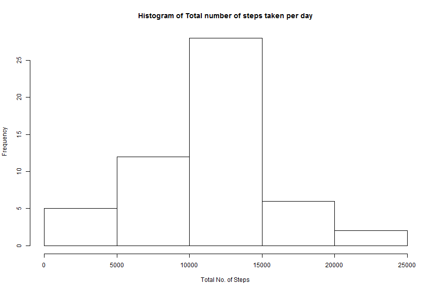
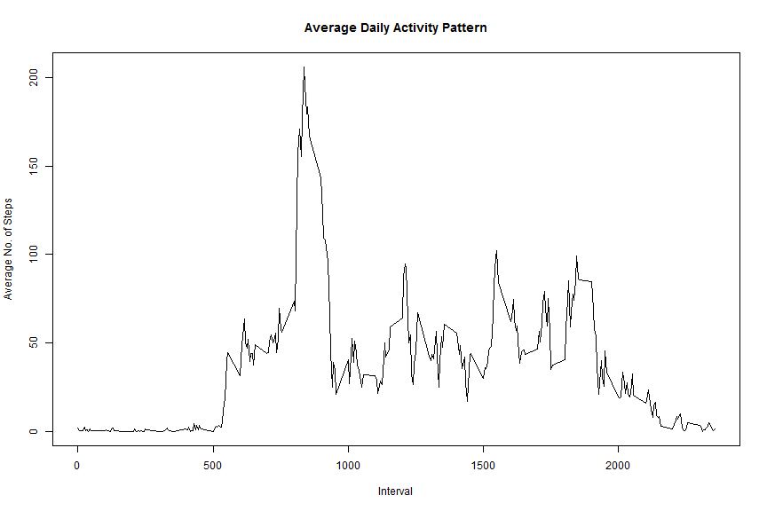
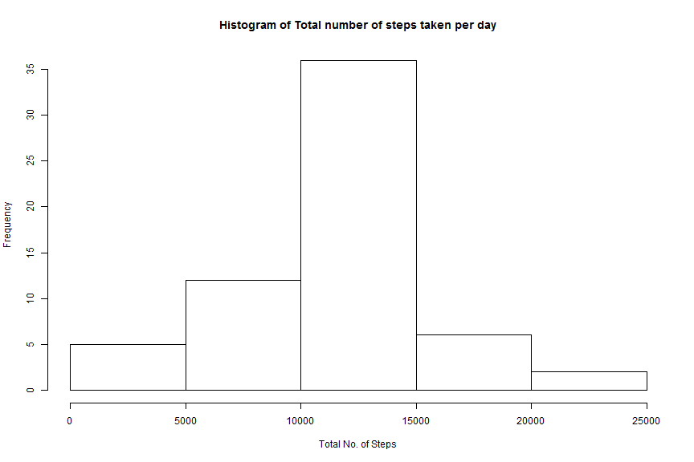
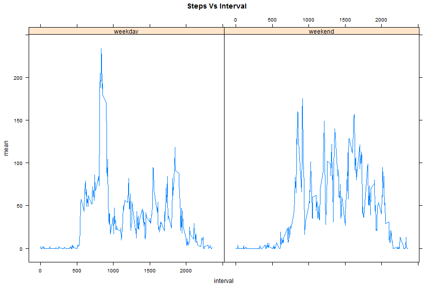

# Peer Assessment 1
<!--Steps performed
* Read the Activity Monitoring data 
* Converted the date variable type as Date
* Calculated the total number of steps per day using aggregate function
-->

```r
activitydata<-read.csv("activity.csv", header=TRUE)
activitydata$date<-as.Date(activitydata$date,"%Y-%m-%d")
activityaggr<-aggregate(cbind(steps) ~ date, activitydata, FUN=sum, na.rm=TRUE, na.action="na.omit")
```
## Histogram of total number of steps per day  

```r
hist(x=activityaggr$steps,xlab="Total No. of Steps",main="Histogram of Total number of steps taken per day")
```

 

## Mean of the total number of steps taken per day  

```r
round(mean(activityaggr$steps, na.rm=TRUE),2)
```

```
## [1] 10766.19
```
## Median of the total number of steps taken per day

```r
round(median(activityaggr$steps, na.rm=TRUE),2)
```

```
## [1] 10765
```
## Average Daily Activity Graph

```r
library(plyr)
actaverage<-ddply(activitydata, .(interval), summarise, mean=round(mean(steps, na.rm=TRUE),2))
plot(actaverage$interval, actaverage$mean, type="l", main="Average Daily Activity Pattern", xlab="Interval", ylab="Average No. of Steps")
```

 

## 5 Minute Interval that has Maximum Number of steps 

```r
actaverage[actaverage$mean==max(actaverage$mean),1]
```

```
## [1] 835
```

## Total Number of missing values in the dataset

```r
nrow(activitydata[is.na(activitydata$steps),])
```

```
## [1] 2304
```

##Steps used for imputation
1. Iterate thru each row in activitydata
2. Check if the step value is NA
3. If it is true, then calculate the average for that interval for all the days and assign that value to it


```r
nactivitydata <- activitydata
for(i in 1:nrow(nactivitydata)) {
       if(is.na(nactivitydata[i,1])) {
               ival<-nactivitydata[i,3]
               nactivitydata[i,1] <- round( mean(nactivitydata[nactivitydata$interval == ival,1],na.rm=TRUE),0)
       } 
}
nactivityaggr<-aggregate(cbind(steps) ~ date, nactivitydata, FUN=sum, na.rm=TRUE, na.action="na.omit")
```
## Histogram of total number of steps per day after imputation

```r
hist(x=nactivityaggr$steps,xlab="Total No. of Steps",main="Histogram of Total number of steps taken per day")
```

 

## Mean of the total number of steps taken per day after imputation 

```r
round(mean(nactivityaggr$steps, na.rm=TRUE),2)
```

```
## [1] 10765.64
```
## Median of the total number of steps taken per day after imputation

```r
round(median(nactivityaggr$steps, na.rm=TRUE),2)
```

```
## [1] 10762
```

## The Mean and Median values slightly differ before and after imputation but not much.
## The histogram pattern looks identical before and after the imputation and I didn't find much difference after imputing the data.


Weekdays Vs Weekend Graph comparison
---

```r
activitydata$weekdays<-weekdays(activitydata$date)
activitydata$weekdays[activitydata$weekdays=="Sunday"|activitydata$weekdays=="Saturday"]<-"weekend"
activitydata$weekdays[!(activitydata$weekdays=="weekend")]<-"weekday"
activitydata$weekdays<-as.factor(activitydata$weekdays)

actavg<-ddply(activitydata, .(weekdays,interval), summarise, mean=round(mean(steps, na.rm=TRUE),0))

library(lattice)
xyplot(mean~interval | factor(weekdays), data=actavg, pch=19, main="Steps Vs Interval",type="l")
```

 

## The pattern between weekday and weekend is different. The number of steps are high during weekend compare to weekday except between interval 750 and 1000.
